# ShopLens

Shoplens is a platform where users can buy products without needing to scan them at the cashier ShopLens comes up with an in-built QR code scanner that can be used to scan products and add products to the cart or buy them right away without any hassle from the app itself.
Shoplens also provides store owners with an intuitive user interface where they can add products, check sales, etc.

# App screenshots

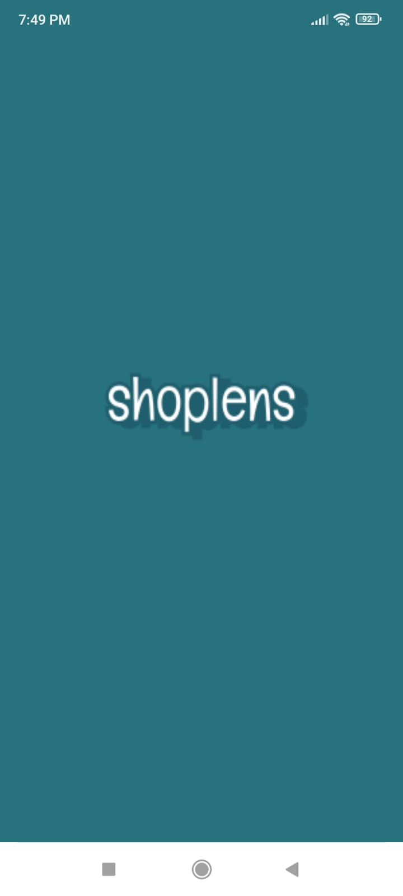 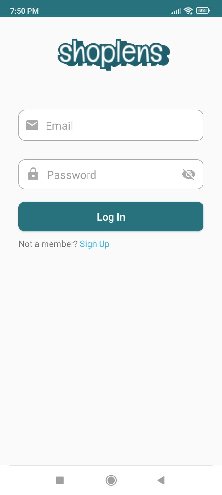 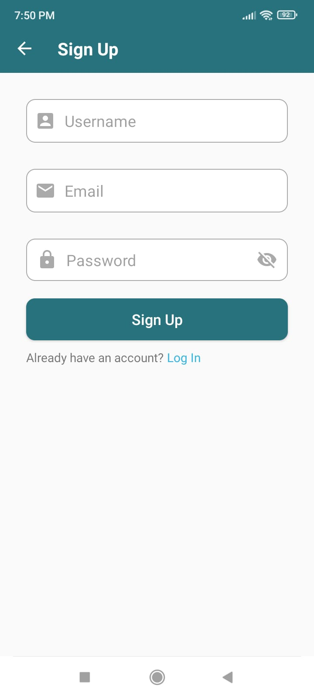 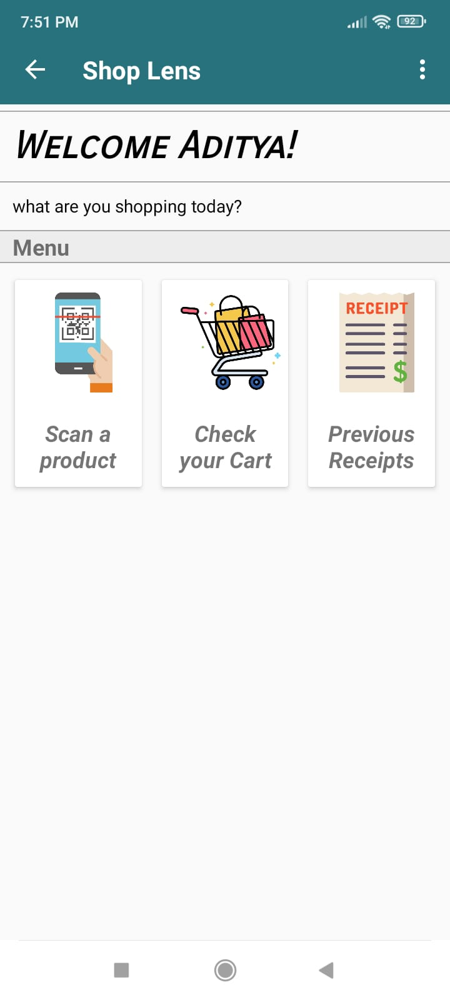 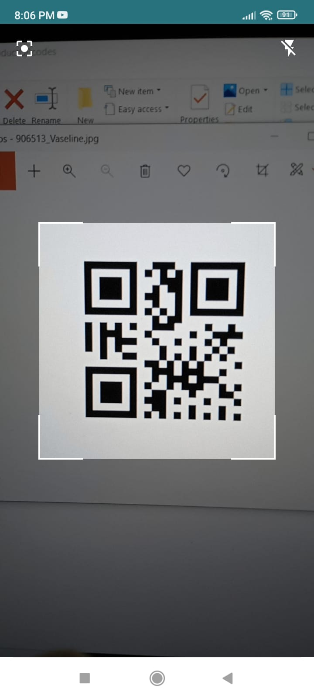 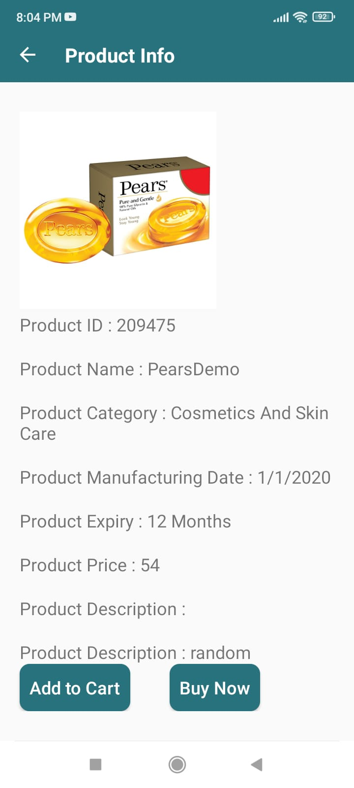 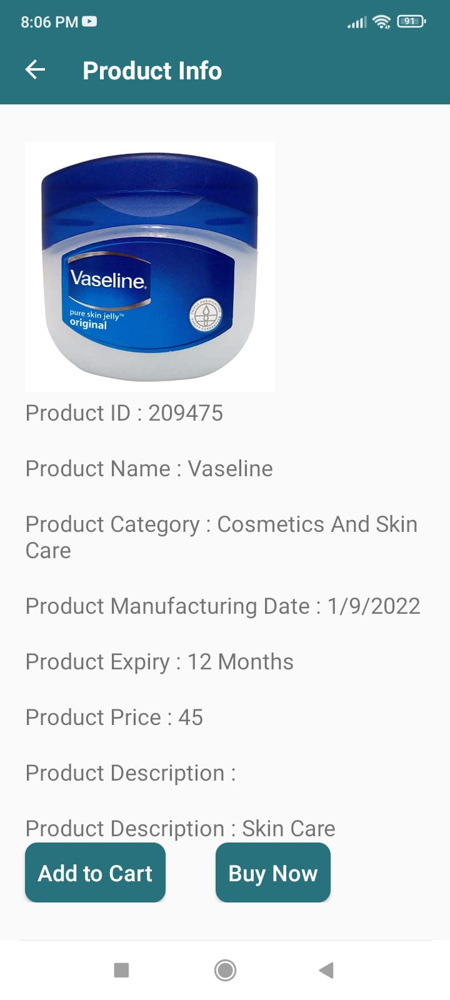 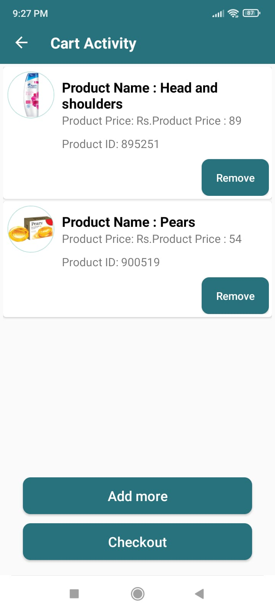 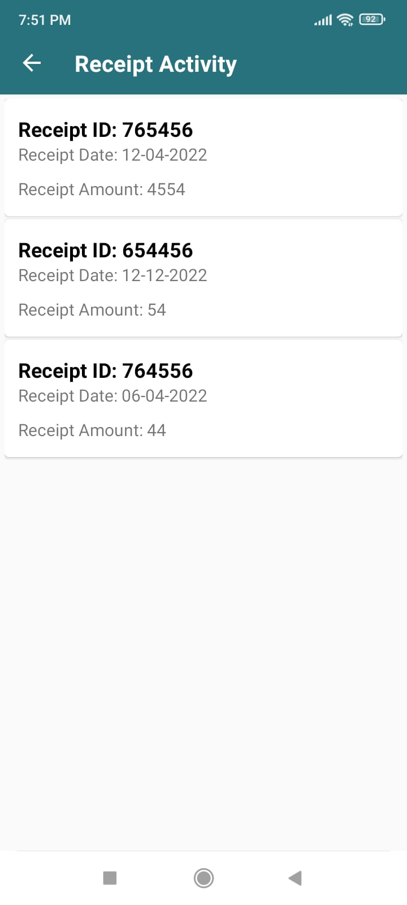

# Inventory System screenshots

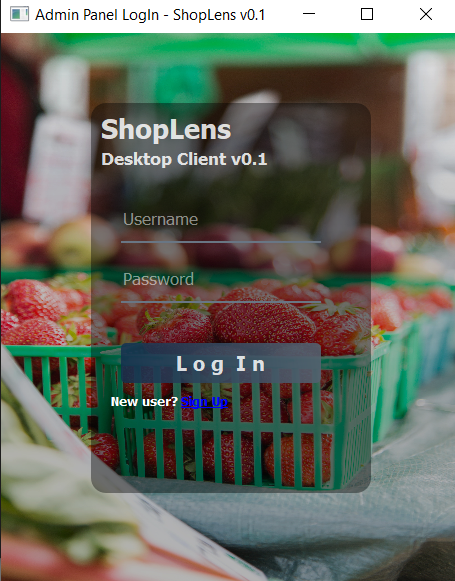 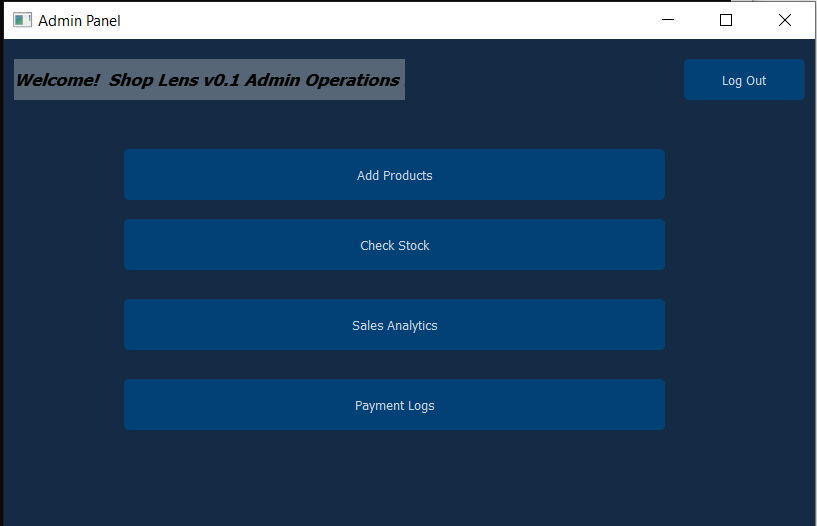 
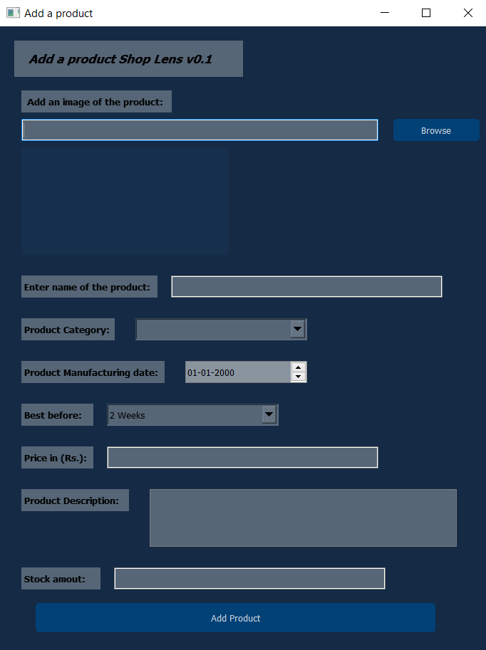 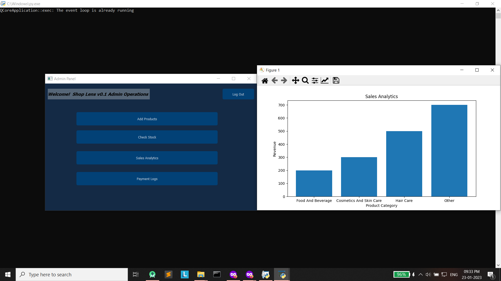

